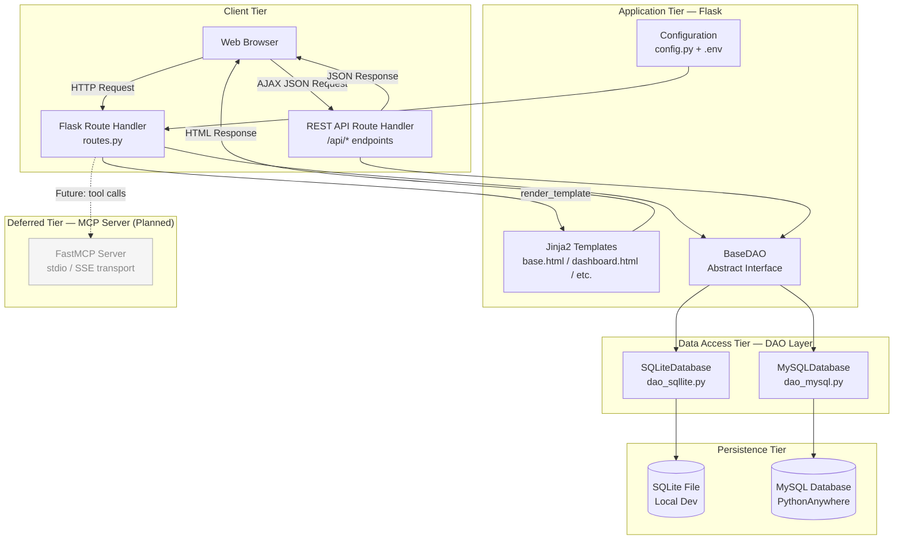
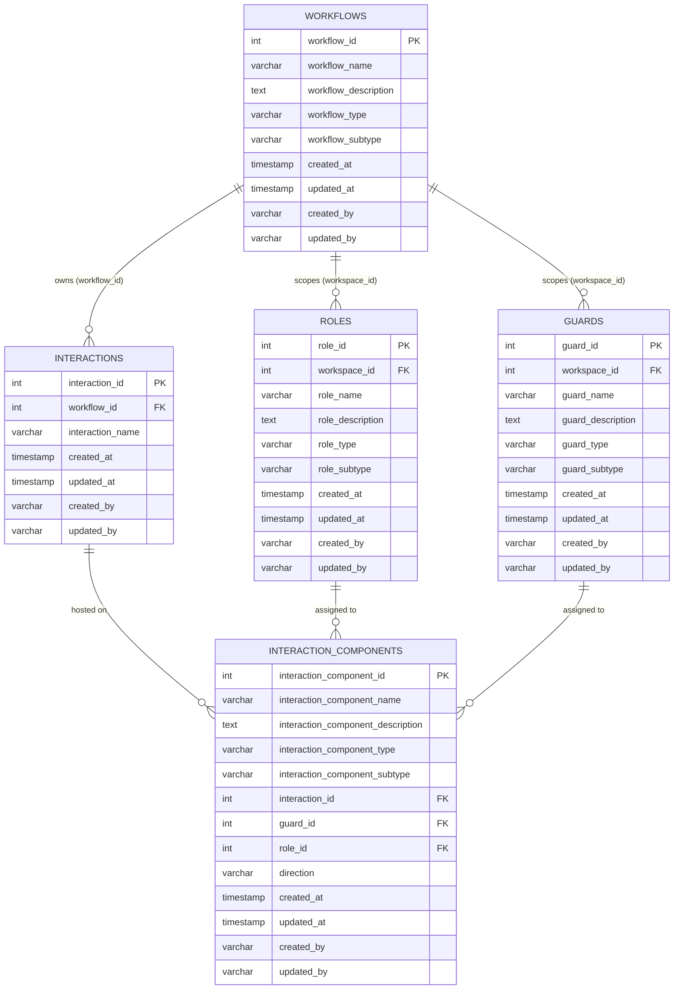
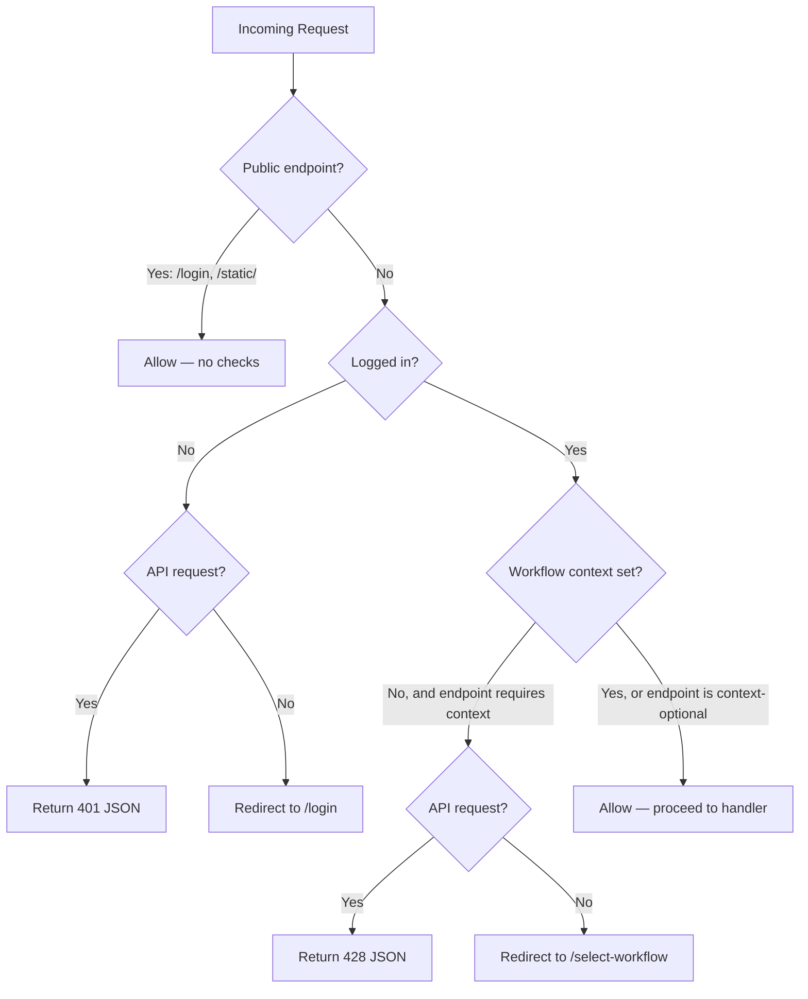
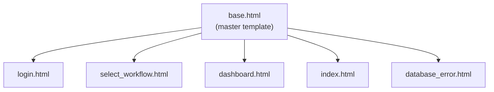

# PDFA Web Services and Application — Software Design Document

| Field | Detail |
|---|---|
| **Module** | 8640 — Web Services and Applications — Type A (25/26) |
| **Author** | Clyde Watts |
| **Date** | 21 April 2026 |
| **Version** | 1.0 |
| **Status** | Draft — College Submission |

---

> **Original Prompt (verbatim):**
>
> *"Please review software and create a detailed design document, which explains the design in such a way that a project manager will understand, include a database model, also the design of the various levels of the website hierarchy, and how it all hangs together. Remember this is for a college project, so that the lecturer and student understand how this works. Include this prompt in the document."*

---

## Table of Contents

1. [Executive Summary](#1-executive-summary)
2. [Technology Stack](#2-technology-stack)
3. [System Architecture](#3-system-architecture)
4. [Database Design](#4-database-design)
5. [Application Layers](#5-application-layers)
6. [Website Hierarchy and Navigation](#6-website-hierarchy-and-navigation)
7. [Template Design](#7-template-design)
8. [Authentication and Security](#8-authentication-and-security)
9. [REST API Design](#9-rest-api-design)
10. [Deployment Targets](#10-deployment-targets)
11. [Testing Strategy](#11-testing-strategy)
12. [Glossary](#12-glossary)

---

## 1. Executive Summary

### 1.1 What is PDFA?

**PDFA** (Petri net / Directed Flow Application) is a **web-based configuration dashboard** that allows a user to define, manage, and visualise the structure of workflow systems built on a **colour Petri net model**.

In plain terms: imagine a business process like "submit a leave request". That process has steps, people or systems that act on it, validators that check whether it can proceed, and connections between all of those pieces. PDFA is the tool used to define and manage all of those pieces — giving them names, types, and relationships — before a workflow engine runs them.

### 1.2 What Problem Does It Solve?

Without a tool like PDFA, workflow definitions would have to be edited directly in code or database scripts. PDFA replaces that with a clean web interface that any authorised user can operate without needing to write code.

### 1.3 Who Are the Users?

| User Type | What They Do |
|---|---|
| **Workflow Designer** | Creates and configures workflow structures (steps, validators, roles) |
| **System Administrator** | Manages the overall set of workflows; switches between workflow contexts |
| **Developer / Student** | Builds and extends the application for coursework |

### 1.4 Scope of This Project

This project is a college submission for module **8640 — Web Services and Applications**. It demonstrates:

- A working **multi-layer web application** (Flask front-end, DAO data layer, database back-end)
- A **RESTful JSON API** for programmatic access
- **Session-based authentication** with CSRF protection
- **Multi-tenant data scoping** (each workflow is isolated)
- **Database portability** (SQLite for local development, MySQL for cloud deployment)
- A **planned MCP (Model Context Protocol) integration tier** that has been designed but deferred due to hosting constraints (explained in Section 3.3)

---

## 2. Technology Stack

| Layer | Technology | Purpose |
|---|---|---|
| **Language** | Python 3.11+ | Core application language |
| **Web Framework** | Flask 3.0 | HTTP routing, templating, session management |
| **Templating** | Jinja2 (bundled with Flask) | Server-side HTML rendering |
| **Database (local dev)** | SQLite 3 | Zero-config file-based database |
| **Database (production)** | MySQL 8 (PythonAnywhere) | Cloud-hosted relational database |
| **Database Abstraction** | Custom DAO pattern (abstract + concrete) | Portable database access layer |
| **Database Drivers** | `mysql-connector-python`, `PyMySQL` | MySQL connectivity (dual-driver fallback) |
| **CSS Framework** | Tailwind CSS v3 (CDN) | Utility-first styling |
| **Graphing** | Graphviz DOT + d3-graphviz | Workflow graph visualisation in the browser |
| **Markdown Rendering** | Python-Markdown | Help content rendering |
| **Configuration** | python-dotenv | `.env` file loading |
| **Testing** | pytest + pytest-flask | Automated test suite |
| **Deployment (local)** | `python run.py` (port 5000) | Local development server |
| **Deployment (cloud)** | PythonAnywhere WSGI | Production hosting |

---

## 3. System Architecture

### 3.1 Overview

The application uses a **layered architecture** with clear separation between the presentation tier (browser + HTML templates), the application tier (Flask), the data access tier (DAO), and the persistence tier (database).

### 3.2 Architecture Diagram



### 3.3 The Deferred MCP Tier

The original design planned a **three-tier architecture** where the Flask web tier would communicate with an intermediate **MCP (Model Context Protocol) server**. The MCP server would act as a tool broker — all data operations (create role, list workflows, etc.) would be implemented as MCP tools, allowing both the web interface and AI agents to access the same capability surface.

This tier has been **designed but not implemented** because:

1. **PythonAnywhere** (the chosen cloud host) does not support long-running external server processes or async ASGI frameworks (Quart).
2. Without a reliable host for the MCP process, the integration cannot be tested or deployed.

The MCP design is documented in specs `003`, `004`, `005`, `006`, and `007`. The application has been deliberately structured so that the DAO layer (see Section 5.2) could be wrapped by MCP tools in a future iteration without requiring changes to the business logic.

### 3.4 Request Lifecycle

The following describes the path of a typical user request through the application layers:

```
1. Browser sends GET /dashboard/roles
2. Flask's before_request hook (enforce_auth_and_context) runs:
   a. Is the user logged in? (session["logged_in"])
   b. Is a workflow context set? (session["workflow_id"])
   c. If either check fails → redirect or JSON 401/428
3. Flask route handler runs:
   a. Calls get_db_provider() → instantiates DAO from factory, stored on g
   b. Calls DAO methods (e.g. select_all_from_role_table())
   c. Filters rows to active workflow context (_workflow_scoped_rows)
   d. Passes data dict to render_template()
4. Jinja2 renders dashboard.html (extends base.html)
5. HTML response returned to browser
```

---

## 4. Database Design

### 4.1 Entity Overview

The database stores the building blocks of a workflow defined using a **colour Petri net model**:

| Concept | Petri Net Equivalent | Plain Meaning |
|---|---|---|
| **Workflow** | The net itself | A named process (e.g. "Leave Request Flow") |
| **Interaction** | **Place (node)** | A step or buffer in the process where work pauses |
| **Guard** | **Transition validator** | A rule that checks whether work can move to the next step |
| **Role** | **Token modifier** | A person or system that acts on the work item and can change its data |
| **Interaction Component** | **Arc (directed edge)** | A connection between an interaction, a role, and/or a guard with a direction |

### 4.2 Entity Relationship Diagram



### 4.3 Table Definitions

#### 4.3.1 `workflows`

This is the **root entity**. Every other table is scoped to a workflow. Think of it as defining a named process container.

| Column | Type | Required | Notes |
|---|---|---|---|
| `workflow_id` | INT | Yes (PK) | Auto-increment primary key |
| `workflow_name` | VARCHAR | Yes | Unique name for the workflow |
| `workflow_description` | TEXT | No | Human-readable description |
| `workflow_type` | VARCHAR | Yes | Category (e.g. `"ProcessFlow"`, `"DataPipeline"`) |
| `workflow_subtype` | VARCHAR | No | Sub-category (e.g. `"Standard"`) |
| `created_at` | TIMESTAMP | Auto | Set on INSERT |
| `updated_at` | TIMESTAMP | Auto | Updated on UPDATE |
| `created_by` | VARCHAR | Yes | Username of creator |
| `updated_by` | VARCHAR | No | Username of last editor |

#### 4.3.2 `roles`

Roles are the **actors** in the workflow — a human user, an AI agent, or a deterministic system. Roles are the only entities permitted to **modify** the Unit of Work (the data payload travelling through the workflow).

| Column | Type | Required | Notes |
|---|---|---|---|
| `role_id` | INT | Yes (PK) | Auto-increment |
| `workspace_id` | INT | Yes (FK) | References `workflows.workflow_id` — CASCADE DELETE |
| `role_name` | VARCHAR | Yes | Unique within the workflow |
| `role_description` | TEXT | No | What this role does |
| `role_type` | VARCHAR | Yes | `"AI Agent"`, `"Human"`, `"Deterministic"` |
| `role_subtype` | VARCHAR | No | Further classification |
| `created_at` | TIMESTAMP | Auto | |
| `updated_at` | TIMESTAMP | Auto | |
| `created_by` | VARCHAR | Yes | |
| `updated_by` | VARCHAR | No | |

#### 4.3.3 `guards`

Guards are **validators**. They inspect the Unit of Work and decide whether it is allowed to pass from one interaction to another. They do not modify the data — they only approve or block movement.

| Column | Type | Required | Notes |
|---|---|---|---|
| `guard_id` | INT | Yes (PK) | Auto-increment |
| `workspace_id` | INT | Yes (FK) | References `workflows.workflow_id` — CASCADE DELETE |
| `guard_name` | VARCHAR | Yes | Unique within the workflow |
| `guard_description` | TEXT | No | What condition this guard checks |
| `guard_type` | VARCHAR | Yes | Classification of the guard logic |
| `guard_subtype` | VARCHAR | No | Further classification |
| `created_at` | TIMESTAMP | Auto | |
| `updated_at` | TIMESTAMP | Auto | |
| `created_by` | VARCHAR | Yes | |
| `updated_by` | VARCHAR | No | |

#### 4.3.4 `interactions`

Interactions are the **steps (nodes)** of the workflow — they are stateless buffers where the Unit of Work waits. An interaction does not perform logic itself; it simply holds the work item until a guard or role acts on it.

| Column | Type | Required | Notes |
|---|---|---|---|
| `interaction_id` | INT | Yes (PK) | Auto-increment |
| `workflow_id` | INT | Yes (FK) | References `workflows.workflow_id` — CASCADE DELETE |
| `interaction_name` | VARCHAR | Yes | Unique within the workflow |
| `created_at` | TIMESTAMP | Auto | |
| `updated_at` | TIMESTAMP | Auto | |
| `created_by` | VARCHAR | Yes | |
| `updated_by` | VARCHAR | No | |

> **Note**: Interactions intentionally have fewer fields than other entities. This reflects the Petri net model — places (interactions) are structurally simple; the logic lives in the transitions (guards and roles).

#### 4.3.5 `interaction_components`

Interaction components are the **directed edges (arcs)** of the workflow graph. Each component connects an interaction to an optional role and/or optional guard, with a defined direction of flow (`inbound`, `outbound`, or `bidirectional`). This is the most complex entity as it represents the actual wiring of the workflow.

| Column | Type | Required | Notes |
|---|---|---|---|
| `interaction_component_id` | INT | Yes (PK) | Auto-increment |
| `interaction_component_name` | VARCHAR | Yes | Descriptive name for the connection |
| `interaction_component_description` | TEXT | No | What this connection represents |
| `interaction_component_type` | VARCHAR | Yes | Classification |
| `interaction_component_subtype` | VARCHAR | No | Further classification |
| `interaction_id` | INT | Yes (FK) | References `interactions.interaction_id` — CASCADE DELETE |
| `guard_id` | INT | No (FK) | References `guards.guard_id` — CASCADE DELETE (optional) |
| `role_id` | INT | No (FK) | References `roles.role_id` — CASCADE DELETE (optional) |
| `direction` | VARCHAR | Yes | `"inbound"`, `"outbound"`, or `"bidirectional"` |
| `created_at` | TIMESTAMP | Auto | |
| `updated_at` | TIMESTAMP | Auto | |
| `created_by` | VARCHAR | Yes | |
| `updated_by` | VARCHAR | No | |

### 4.4 Control Columns (Audit Trail)

Every table includes four **control columns**: `created_at`, `updated_at`, `created_by`, and `updated_by`.

- `created_at` and `updated_at` are set automatically by the database engine (`DEFAULT CURRENT_TIMESTAMP` / `ON UPDATE CURRENT_TIMESTAMP` in MySQL; generated in Python for SQLite).
- `created_by` and `updated_by` are populated by the application with the current session username.
- These columns provide a simple **audit trail** — a record of who created or changed each row and when.

### 4.5 Referential Integrity and Cascade Delete

All foreign keys are defined with `ON DELETE CASCADE`. This means:

- Deleting a **workflow** automatically deletes all its roles, guards, interactions, and interaction components.
- Deleting an **interaction** automatically deletes all interaction components attached to it.
- Deleting a **role** or **guard** automatically nullifies or removes interaction components that reference it.

This prevents **orphaned records** and keeps the database consistent without requiring the application to manually clean up related rows.

### 4.6 Database Portability

The same data model runs on both **SQLite** (local development) and **MySQL** (production). Key differences are handled in the DAO implementations:

| Feature | SQLite | MySQL |
|---|---|---|
| `AUTO_INCREMENT` | `INTEGER PRIMARY KEY` (implicit) | `INT AUTO_INCREMENT` |
| `CURRENT_TIMESTAMP on UPDATE` | Managed in Python | Native SQL |
| Connection | `sqlite3.connect(file_path)` | `mysql.connector.connect(host, user, ...)` |
| Referential integrity | `PRAGMA foreign_keys = ON` | Default (InnoDB) |

---

## 5. Application Layers

### 5.1 Configuration Layer

**Files**: `config.py`, `.env`

The `Config` class in `config.py` reads all settings from environment variables, falling back to sensible defaults for local development.

| Environment Variable | Purpose | Default |
|---|---|---|
| `SECRET_KEY` | Flask session encryption key | `dev-secret-key-123` |
| `DB_BACKEND` | Database engine selector: `"mysql"` or `""` (SQLite) | `""` (SQLite) |
| `DB_URL` | Full SQLite file path (e.g. `sqlite:///./relative_test.sqlite3`) | Derived from `DB_NAME` |
| `DB_NAME` | Database or SQLite filename | |
| `DB_HOST` | MySQL host | `127.0.0.1` |
| `DB_USER` | MySQL username | |
| `DB_PASSWORD` | MySQL password | |
| `DB_PORT` | MySQL port | `3306` |
| `PYTHONANYWHERE_DOMAIN` | Auto-detected; triggers MySQL mode when present | (set by PythonAnywhere) |

**Selection Logic** (`_resolve_dao_factory()` in `flask_app.py`):

```
IF DB_BACKEND == "mysql"
  OR (DB_BACKEND is empty AND PYTHONANYWHERE_DOMAIN env var is set)
→ Use MySQLDatabase

ELSE
→ Use SQLiteDatabase
   Resolve file path:
     1. Parse DB_URL if set (strip "sqlite:///" prefix)
     2. Fall back to DB_NAME
     3. Resolve relative paths against the project root directory
```

This logic means the application automatically uses MySQL on PythonAnywhere and SQLite everywhere else, with no code changes required.

### 5.2 DAO (Data Access Object) Layer

**Files**: `app/databases/dao_base.py`, `app/databases/dao_mysql.py`, `app/databases/dao_sqllite.py`

The DAO layer is the application's **database abstraction barrier**. Its design follows the **Strategy pattern**: a single abstract interface (`BaseDAO`) defines every data operation the application needs; the concrete implementations (`SQLiteDatabase`, `MySQLDatabase`) provide the actual SQL.

#### 5.2.1 BaseDAO (Abstract Interface)

`BaseDAO` is an **abstract base class** (using Python's `abc` module). It declares every method that the application will ever call on the database, but contains no implementation. This contract guarantees that both SQLite and MySQL behave identically from the route handler's perspective.

Method groups defined:

| Group | Methods |
|---|---|
| **Connection** | `connect()`, `ensure_connection()`, `ping()`, `close()` |
| **Schema** | `create_database()`, `create_table()`, `drop_*_table()` |
| **Workflow CRUD** | `create_workflow_table()`, `insert_into_workflow_table()`, `select_from_workflow_table()`, `select_all_from_workflow_table()`, `update_workflow_table()`, `delete_from_workflow_table()` |
| **Role CRUD** | Same pattern as Workflow |
| **Guard CRUD** | Same pattern as Workflow |
| **Interaction CRUD** | Same pattern as Workflow |
| **Interaction Component CRUD** | Same pattern as Workflow |

#### 5.2.2 Return Tuple Convention

**Every** DAO method returns a 3-tuple: `(return_code, error_message, data)`

| Position | Type | Meaning |
|---|---|---|
| `return_code` | `int` | `0` = success, `-1` = failure |
| `error_message` | `str \| None` | Error description on failure, `None` on success |
| `data` | `Any` | The result (a dict, list, new ID, etc.) on success; `None` on failure |

This convention allows route handlers to check the outcome and respond appropriately without using exceptions for expected failures (e.g. "row not found").

#### 5.2.3 SQLiteDatabase

- Wraps Python's built-in `sqlite3` module — no additional driver needed.
- Sets `row_factory = sqlite3.Row` so rows behave like dictionaries.
- Enables `PRAGMA foreign_keys = ON` on every connection to enforce referential integrity.
- Generates ISO-format UTC timestamps in Python (`_current_timestamp()`), since SQLite's `ON UPDATE` is not natively supported.
- Provides helper methods (`_insert_row()`, `_update_row()`, `_select_row()`, etc.) used internally by all entity CRUD methods.

#### 5.2.4 MySQLDatabase

- Uses `mysql-connector-python` as the primary driver.
- Falls back to `PyMySQL` automatically if the MySQL native auth plugin causes a connection error (a known issue on some hosting platforms).
- A `_PyMySQLConnectionAdapter` class wraps the PyMySQL connection to make its API identical to the mysql-connector API.
- A `@_instrument_dao_methods` decorator automatically logs the start and any errors of every DAO method call, providing an audit trail in the application logs without modifying individual methods.

### 5.3 Flask Application Factory

**File**: `app/flask_app.py`

Flask is configured using the **Application Factory pattern**. Instead of creating a global `app` object at module level (which causes problems with testing and configuration), a `create_app()` function creates and returns a configured Flask instance.

**Steps inside `create_app()`**:

1. Create the Flask instance with the correct template and static paths.
2. Load configuration from the `Config` class.
3. Call `_resolve_dao_factory()` to determine which DAO class and connection parameters to use.
4. Store the DAO factory in `app.extensions["dao_factory"]` for later use.
5. Open an application context and **bootstrap the schema**: call `create_workflow_table()`, `create_role_table()`, etc. This creates all tables at startup if they do not already exist (safe to call repeatedly — uses `CREATE TABLE IF NOT EXISTS`).
6. Register the routes blueprint.
7. Return the app.

**Per-Request DAO** (`get_db_provider()`):

Each HTTP request gets its own database connection, stored on Flask's `g` object (a request-scoped storage). On first use within a request, `get_db_provider()` reads the factory from `app.extensions`, instantiates the DAO, calls `connect()`, and returns it. The connection is closed at request teardown.

### 5.4 Routes Layer

**File**: `app/routes.py`

All routes are registered on a Flask **Blueprint** (`bp`). This keeps the routing code decoupled from the application creation.

The routes fall into four functional groups:

| Group | Prefix | Mechanism |
|---|---|---|
| **Authentication** | `/login`, `/logout` | Form POST; session management |
| **Workflow Context** | `/select-workflow`, `/set-context`, `/swap` | Form POST; sets `session["workflow_id"]` |
| **Dashboard (HTML)** | `/dashboard`, `/dashboard/<section>` | GET; render_template |
| **Form CRUD** | `/dashboard/<entity>/save`, `/dashboard/<entity>/<id>/delete` | POST; form submission |
| **REST API** | `/api/<entity>`, `/api/<entity>/<id>` | GET/POST/PUT/DELETE; JSON |
| **Help** | `/help`, `/help/<topic>` | GET; JSON (markdown rendered) |

A **context processor** (`@bp.app_context_processor`) injects helper values into every template render:
- `csrf_token()` — function that returns the current session CSRF token
- `active_username` — the logged-in username
- `active_workflow_name` — the currently selected workflow name
- `user_initials` — up to two characters taken from the username, used for the avatar

---

## 6. Website Hierarchy and Navigation

### 6.1 URL Tree

The complete URL structure of the application, organised by function:

```
/ (root)
│
├── /login                          [GET]  — Login page
├── /login                          [POST] — Submit credentials
├── /logout                         [GET]  — End session
│
├── /select-workflow                [GET]  — Choose or create a workflow
├── /select-workflow/create         [POST] — Quick-create a workflow
├── /set-context                    [POST] — Activate an existing workflow
├── /swap                           [GET]  — Deactivate current workflow
│
├── /dashboard                      [GET]  — Redirects to /dashboard/workflows
├── /dashboard/workflows            [GET]  — List all workflows
├── /dashboard/roles                [GET]  — List roles in active workflow
├── /dashboard/guards               [GET]  — List guards in active workflow
├── /dashboard/interactions         [GET]  — List interactions in active workflow
├── /dashboard/interaction-components [GET] — List components in active workflow
│
├── /dashboard/workflows/save       [POST] — Create or update a workflow
├── /dashboard/workflows/<id>/delete [POST] — Delete a workflow
├── /dashboard/roles/save           [POST] — Create or update a role
├── /dashboard/roles/<id>/delete    [POST] — Delete a role
├── /dashboard/guards/save          [POST] — Create or update a guard
├── /dashboard/guards/<id>/delete   [POST] — Delete a guard
├── /dashboard/interactions/save    [POST] — Create or update an interaction
├── /dashboard/interactions/<id>/delete [POST] — Delete an interaction
├── /dashboard/interaction-components/save [POST] — Create or update a component
├── /dashboard/interaction-components/<id>/delete [POST] — Delete a component
│
├── /api/workflows                  [GET, POST]
├── /api/workflows/<id>             [GET, PUT, DELETE]
├── /api/workflows/visualize        [GET]  — Graphviz DOT for active workflow
├── /api/roles                      [GET, POST]
├── /api/roles/<id>                 [GET, PUT, DELETE]
├── /api/guards                     [GET, POST]
├── /api/guards/<id>                [GET, PUT, DELETE]
├── /api/interactions               [GET, POST]
├── /api/interactions/<id>          [GET, PUT, DELETE]
├── /api/interaction-components     [GET, POST]
├── /api/interaction-components/<id> [GET, PUT, DELETE]
│
├── /help                           [GET]  — Help index (JSON)
└── /help/<topic>                   [GET]  — Help topic (JSON, markdown rendered)
```

### 6.2 User Journey Flow

The following diagram shows how a user navigates through the application from first visit to completing a CRUD operation:

```mermaid
flowchart TD
    A([User visits /]) --> B{Session state?}
    B -->|Not logged in| C[/login — Login Page/]
    B -->|Logged in, no workflow| D[/select-workflow — Choose Workflow/]
    B -->|Logged in + workflow set| E[/dashboard — Dashboard/]

    C -->|POST /login — credentials| D
    D -->|POST /set-context — select existing| E
    D -->|POST /select-workflow/create — create new| E

    E --> F{Navigate sidebar}
    F --> G[/dashboard/workflows]
    F --> H[/dashboard/roles]
    F --> I[/dashboard/guards]
    F --> J[/dashboard/interactions]
    F --> K[/dashboard/interaction-components]

    G --> L{Action}
    H --> L
    I --> L
    J --> L
    K --> L

    L -->|Click Create or Edit| M[Entity Editor Drawer opens]
    M -->|Submit form| N[POST /dashboard/<entity>/save]
    N -->|Success| O[Redirect back to section + toast]
    O --> F

    L -->|Click Delete| P[Confirm → POST /dashboard/<entity>/<id>/delete]
    P -->|Success| O

    E -->|Click Swap Workflow| D
    E -->|Click Log Off| C

    G -->|Help button| Q[Help Drawer opens — AJAX /help/<topic>]
```

### 6.3 Access Control Flow

Before any protected route handler runs, the `enforce_auth_and_context()` before-request hook checks:



**Context-optional endpoints** (do not require a workflow to be set): `/select-workflow`, `/select-workflow/create`, `/set-context`, `/swap`, `/dashboard/workflows` (read-only listing).

---

## 7. Template Design

### 7.1 Template Hierarchy

All HTML pages are built using Jinja2's **template inheritance**. A single master template (`base.html`) defines the overall HTML structure, CSS imports, JavaScript libraries, and the toast notification system. Child templates extend it and fill in named **blocks**.



### 7.2 `base.html` — Master Template

**Purpose**: Defines the complete HTML document shell. All other templates inherit from this.

**Blocks provided for child templates to fill**:

| Block Name | Purpose |
|---|---|
| `` | The `<title>` tag content |
| `` | The full `<body>` content (rarely overridden directly) |
| `` | The main page content area (used by all children) |
| `` | Additional `<script>` tags injected just before `</body>` |

**Included by base.html (always present)**:
- Tailwind CSS v3 from CDN — custom Google-inspired colour palette configured via `tailwind.config`
- d3-graphviz + Graphviz WASM — for workflow graph visualisation
- Toast notification system — renders Flask `flash()` messages as dismissible pop-up notifications in the bottom-left corner

### 7.3 `login.html`

**Purpose**: Authentication entry point.  
**Extends**: `base.html`  
**Layout**: Centred card on a grey background.

**Form fields**:
- `username` — text input (required)
- `password` — password input (required)
- `csrf_token` — hidden input (populated by `{{ csrf_token() }}` context processor)

**Form action**: `POST /login`

### 7.4 `select_workflow.html`

**Purpose**: Lets the user choose which workflow to work on, or create a new one quickly.  
**Extends**: `base.html`  
**Layout**: Grid of workflow cards + inline create form.

**Workflow cards**: Each existing workflow is displayed as a clickable card. Clicking it submits a hidden form (`POST /set-context`) with the `workflow_id`.

**Quick-create form** (`POST /select-workflow/create`):
- `workflow_name` (required)
- `workflow_description`
- `workflow_type` (required)
- `workflow_subtype` (defaults to "Standard")

**Empty state**: If no workflows exist, only the create form is shown.

### 7.5 `dashboard.html`

**Purpose**: The main working interface. This is the most complex template.  
**Extends**: `base.html`

The dashboard layout has five major zones:

#### Zone 1 — Header (fixed, top)

- Sidebar toggle button (for mobile)
- Application branding: "PDFA / Web Tier"
- Active workflow name badge
- Search placeholder (visual only — not functional in current version)
- "Swap Workflow" link → `GET /swap`
- "Log off" link → `GET /logout`
- Help button (triggers help drawer AJAX load)
- User avatar (initials derived from username)

#### Zone 2 — Sidebar (fixed, left, 248 px wide)

Navigation links for each section:

| Label | URL |
|---|---|
| Workflows | `/dashboard/workflows` |
| Roles | `/dashboard/roles` |
| Guards | `/dashboard/guards` |
| Interactions | `/dashboard/interactions` |
| Interaction Components | `/dashboard/interaction-components` |

The active section link is highlighted. Sections not yet fully implemented show a "Soon" badge.

#### Zone 3 — Summary Cards (top of main area)

Three metric cards displayed in a row:
- **All Workflows** — total count
- **Active Roles** — count scoped to the current workflow
- **Active Guards** — count scoped to the current workflow

#### Zone 4 — Data Table (main content)

A full-width, scrollable table listing entities for the active section. Column sets vary by entity:

| Section | Table Columns |
|---|---|
| Workflows | Name, Description, Type, Created By, Actions |
| Roles | Name, Description, Type, Created By, Actions |
| Guards | Name, Description, Type, Created By, Actions |
| Interactions | Name, Created By, Actions |
| Interaction Components | Name, Interaction, Role, Guard, Direction, Actions |

**Row actions** (revealed on hover):
- **Edit**: Opens the Entity Editor Drawer pre-populated with the row's data
- **Delete**: Submits a confirmation-gated form (`POST /dashboard/<entity>/<id>/delete`)

#### Zone 5 — Entity Editor Drawer (off-screen right, slides in)

A slide-in panel containing a form for creating or editing the selected entity type. The drawer opens when the user clicks "Create" in the section header, or "Edit" on a table row.

- Opens via `data-drawer-open="<entity>"` data attribute (JavaScript event delegation)
- Pre-populates form fields when editing (via `data-<entity>-*` attributes on the button)
- Closes on Escape key press or backdrop click
- Submit button disables itself on click to prevent duplicate submissions

**Interaction Component drawer** additionally contains:
- Interaction dropdown (all interactions in active workflow)
- Role dropdown (optional — all roles in active workflow)
- Guard dropdown (optional — all guards in active workflow)
- Direction radio group: Inbound / Outbound / Bidirectional

#### Zone 6 — Help Drawer (off-screen right, slides in)

A separate slide-in panel that loads contextual help content. Each dashboard section has a corresponding help topic (e.g. `context-roles`, `context-guards`). Content is fetched via AJAX (`GET /help/<topic>`) and rendered from Markdown files in `app/help_content/`.

---

## 8. Authentication and Security

### 8.1 Session-Based Authentication

The application uses **Flask's server-side session** (signed cookie) for authentication state. There is no external identity provider; the login form accepts any non-empty username and password.

> **College Project Note**: In a production system, passwords would be verified against a hashed password store (e.g. bcrypt + users table) or delegated to an OAuth/OIDC provider. The current implementation provides the session structure but uses a placeholder acceptance policy to allow focus on the workflow features.

**Session variables set on login**:

| Variable | Value | Purpose |
|---|---|---|
| `session["logged_in"]` | `True` | Guards all protected routes |
| `session["username"]` | The entered username | Display; audit trail for `created_by` / `updated_by` |
| `session["csrf_token"]` | `token_urlsafe(32)` | Anti-CSRF protection (32 bytes of random data) |

**Variables set when a workflow context is activated**:

| Variable | Value |
|---|---|
| `session["workflow_id"]` | The selected workflow's integer ID |
| `session["workflow_name"]` | The selected workflow's name (for display) |

### 8.2 CSRF Protection

**Cross-Site Request Forgery (CSRF)** is an attack where a malicious website tricks a logged-in user's browser into making an unwanted request to the application. The protection mechanism works as follows:

1. On login, a random 32-byte token is generated and stored in the session.
2. Every HTML form includes the token as a hidden field: `<input type="hidden" name="csrf_token" value="{{ csrf_token() }}">`.
3. AJAX requests include the token in the `X-CSRF-Token` header.
4. JSON API requests can include the token in the JSON body as `"csrf_token"`.
5. Before any mutating operation, `_require_csrf()` checks the submitted token against the session token. Mismatch → reject the request.

Because the token is stored server-side in the session, a malicious third-party site cannot know it and therefore cannot forge a valid request.

### 8.3 Workflow Scoping (Soft Multi-Tenancy)

The application supports multiple workflows. When a user activates a workflow, `session["workflow_id"]` is set. All subsequent data operations are **scoped to that workflow**:

- **Read operations**: The route handler filters results using `_workflow_scoped_rows(rows, workflow_id)`, which removes rows belonging to other workflows.
- **Write operations**: Before creating or updating a role, guard, interaction, or component, the route calls the appropriate `_validate_*_scope()` helper, which confirms the target entity belongs to the active workflow. A mismatch returns HTTP 403 Forbidden.
- **Delete operations**: Similarly validated before deletion.

This prevents data leakage between workflows and acts as a soft permission boundary.

---

## 9. REST API Design

### 9.1 API Overview

The application exposes a **RESTful JSON API** at `/api/*`. This API mirrors the form-based CRUD routes and is intended for:
- AJAX calls from the dashboard JavaScript (e.g. the workflow visualisation endpoint)
- Future integration with the MCP tool tier
- Programmatic access by other tools or tests

All API endpoints require authentication (401 if not logged in). Most require an active workflow context (428 if no workflow is set).

### 9.2 Standard Response Envelopes

| Scenario | HTTP Status | Response Body |
|---|---|---|
| Success (read) | `200 OK` | The requested resource or list |
| Success (create) | `201 Created` | The newly created resource |
| Success (delete) | `200 OK` | `{"status": "deleted", "id": <id>}` |
| Invalid input | `400 Bad Request` | `{"error": "description"}` |
| Not authenticated | `401 Unauthorized` | `{"error": "Authentication required."}` |
| Forbidden (scope) | `403 Forbidden` | `{"error": "description"}` |
| Not found | `404 Not Found` | `{"error": "description"}` |
| No workflow context | `428 Precondition Required` | `{"error": "Workflow context required."}` |
| Server error | `500 Internal Server Error` | `{"error": "description"}` |

### 9.3 Endpoint Reference

#### Workflows

| Method | Path | Context Required | Description |
|---|---|---|---|
| GET | `/api/workflows` | No | List all workflows |
| GET | `/api/workflows/<id>` | No | Get a single workflow |
| POST | `/api/workflows` | No | Create a workflow |
| PUT | `/api/workflows/<id>` | No | Update a workflow |
| DELETE | `/api/workflows/<id>` | No | Delete a workflow |
| GET | `/api/workflows/visualize` | Yes | Graphviz DOT string for active workflow graph |

#### Roles

| Method | Path | Context Required | Description |
|---|---|---|---|
| GET | `/api/roles` | Yes | List all roles (scoped to active workflow) |
| GET | `/api/roles/<id>` | Yes | Get a single role |
| POST | `/api/roles` | Yes | Create a role in active workflow |
| PUT | `/api/roles/<id>` | Yes | Update a role |
| DELETE | `/api/roles/<id>` | Yes | Delete a role |

#### Guards

| Method | Path | Context Required | Description |
|---|---|---|---|
| GET | `/api/guards` | Yes | List all guards (scoped) |
| GET | `/api/guards/<id>` | Yes | Get a single guard |
| POST | `/api/guards` | Yes | Create a guard |
| PUT | `/api/guards/<id>` | Yes | Update a guard |
| DELETE | `/api/guards/<id>` | Yes | Delete a guard |

#### Interactions

| Method | Path | Context Required | Description |
|---|---|---|---|
| GET | `/api/interactions` | Yes | List all interactions (scoped) |
| GET | `/api/interactions/<id>` | Yes | Get a single interaction |
| POST | `/api/interactions` | Yes | Create an interaction |
| PUT | `/api/interactions/<id>` | Yes | Update an interaction |
| DELETE | `/api/interactions/<id>` | Yes | Delete an interaction |

#### Interaction Components

| Method | Path | Context Required | Description |
|---|---|---|---|
| GET | `/api/interaction-components` | Yes | List all components (scoped) |
| GET | `/api/interaction-components/<id>` | Yes | Get a single component (enriched with related names) |
| POST | `/api/interaction-components` | Yes | Create a component |
| PUT | `/api/interaction-components/<id>` | Yes | Update a component |
| DELETE | `/api/interaction-components/<id>` | Yes | Delete a component |

### 9.4 Workflow Visualisation Endpoint

`GET /api/workflows/visualize` is a special endpoint that generates a **Graphviz DOT language** description of the active workflow's graph. The DOT string is returned as JSON:

```json
{
  "dot": "digraph { \"Start Review\" -> \"Approve\" [label=\"ReviewGuard\"]; ... }"
}
```

The dashboard JavaScript picks this up and passes it to **d3-graphviz** in the browser, which renders the directed graph as an SVG. This gives users a visual representation of how interactions connect through guards and roles.

---

## 10. Deployment Targets

### 10.1 Local Development

| Item | Value |
|---|---|
| Entry point | `python run.py` |
| Port | 5000 |
| Database | SQLite (`relative_test.sqlite3` in project root) |
| Config | `.env` file (optional; defaults work without it) |
| Debug mode | Enabled |

**Steps to run locally**:

```bash
# 1. Create and activate virtual environment
python -m venv .venv
.venv\Scripts\activate  # Windows
# or: source .venv/bin/activate  # Linux/macOS

# 2. Install dependencies
pip install -r requirements.txt

# 3. Run the application
python run.py
# → Open http://localhost:5000
```

### 10.2 Production — PythonAnywhere

| Item | Value |
|---|---|
| Entry point | `app.py` (WSGI callable) |
| Database | MySQL (provided by PythonAnywhere) |
| Config | Environment variables set in PythonAnywhere dashboard |
| Debug mode | Disabled |

**Required environment variables on PythonAnywhere**:

```ini
DB_BACKEND=mysql
DB_HOST=<pythonanywhere-mysql-host>
DB_USER=<username>
DB_PASSWORD=<password>
DB_NAME=<database-name>
SECRET_KEY=<strong-random-key>
```

`app.py` exports `application = create_app()` — the WSGI entry point that PythonAnywhere's server looks for.

### 10.3 Deployment Architecture Comparison

| Feature | Local Dev | PythonAnywhere Production |
|---|---|---|
| Database | SQLite file | MySQL server |
| Auto-selected by | Default (no `DB_BACKEND` set) | `PYTHONANYWHERE_DOMAIN` env var OR `DB_BACKEND=mysql` |
| Server | Flask dev server | PythonAnywhere WSGI (gunicorn-equivalent) |
| Port | 5000 | 443 (HTTPS, managed by platform) |
| File storage | Local filesystem | PythonAnywhere filesystem |
| MCP support | Possible (local processes) | Not supported |

---

## 11. Testing Strategy

### 11.1 Test Framework

The project uses **pytest** with the **pytest-flask** plugin. Configuration is in `pytest.ini` at the project root.

```ini
# pytest.ini
[pytest]
testpaths = tests
```

### 11.2 Test Files

| File | Purpose |
|---|---|
| `tests/test_hello_world.py` | Basic smoke test — verifies the application starts and returns a response |
| `tests/test_dao_shared.py` | DAO layer tests — tests shared across both SQLite and MySQL DAO implementations; verifies create/read/update/delete operations at the data layer |
| `tests/test_web_tier.py` | Web tier integration tests — tests routes, authentication, session handling, CSRF, and JSON API responses |

### 11.3 How to Run Tests

```bash
# Run all tests
pytest

# Run with verbose output
pytest -v

# Run a specific test file
pytest tests/test_web_tier.py -v

# Run tests matching a name pattern
pytest -k "test_login" -v
```

### 11.4 Test Strategy Notes

- Tests use a **test configuration** that overrides the database to use an in-memory or temporary SQLite database, ensuring tests do not affect production data.
- The `pytest-flask` plugin provides a `client` fixture that simulates HTTP requests without starting a real server.
- DAO tests (`test_dao_shared.py`) are written against the `BaseDAO` interface, so the same tests can verify both SQLite and MySQL implementations by parameterising the fixture.

---

## 12. Glossary

| Term | Definition |
|---|---|
| **AJAX** | Asynchronous JavaScript and XML — a technique for making HTTP requests from JavaScript without refreshing the page |
| **Blueprint** | A Flask concept for grouping related routes into a reusable module |
| **CSRF** | Cross-Site Request Forgery — an attack where a malicious site tricks a user's browser into making unwanted requests; prevented by the CSRF token mechanism |
| **DAO** | Data Access Object — a design pattern that separates database access code from business logic |
| **DAL** | Data Access Layer — the collective term for all DAO classes |
| **DOT** | A plain text graph description language used by Graphviz |
| **Flask** | A lightweight Python web framework |
| **Guard** | In this application: a validator that decides whether a Unit of Work can move from one interaction to another |
| **Interaction** | A node (place) in the workflow graph — a step where the Unit of Work pauses |
| **Interaction Component** | A directed edge in the workflow graph, connecting an interaction to optional roles and guards |
| **Jinja2** | The HTML templating engine bundled with Flask |
| **MCP** | Model Context Protocol — an open standard for connecting AI agents to tools and data sources |
| **Petri Net** | A mathematical modelling language for distributed systems; this application models workflows as colour Petri nets |
| **Role** | An actor in the workflow (human, AI, or system) that can modify the Unit of Work payload |
| **SQLite** | A self-contained, file-based SQL database engine — no separate server required |
| **WSGI** | Web Server Gateway Interface — the Python standard for web servers and web applications to communicate |
| **UoW** | Unit of Work — the data payload travelling through a workflow instance |
| **Workflow** | A named process definition composed of interactions, guards, roles, and interaction components |

---

*End of Design Document — PDFA Web Services and Application v1.0*  
*Clyde Watts — April 2026 — Module 8640: Web Services and Applications*
